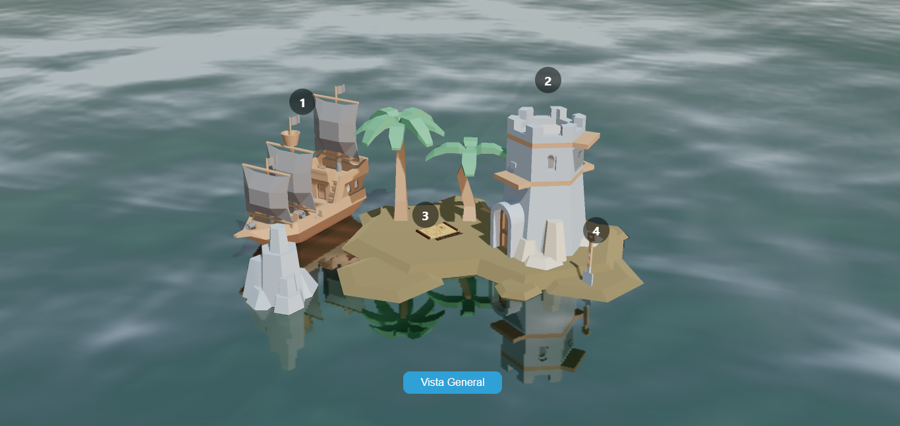

# pirateintscene
Pirate Interactive scene make with ThreeJs

Features:
- Navigation over all scene
- Consult information in the points enumerated

Instalation:
1. npm install
2. npm start
3. In your browser : http://localhost:3000/
4. Navigate the sea!!

